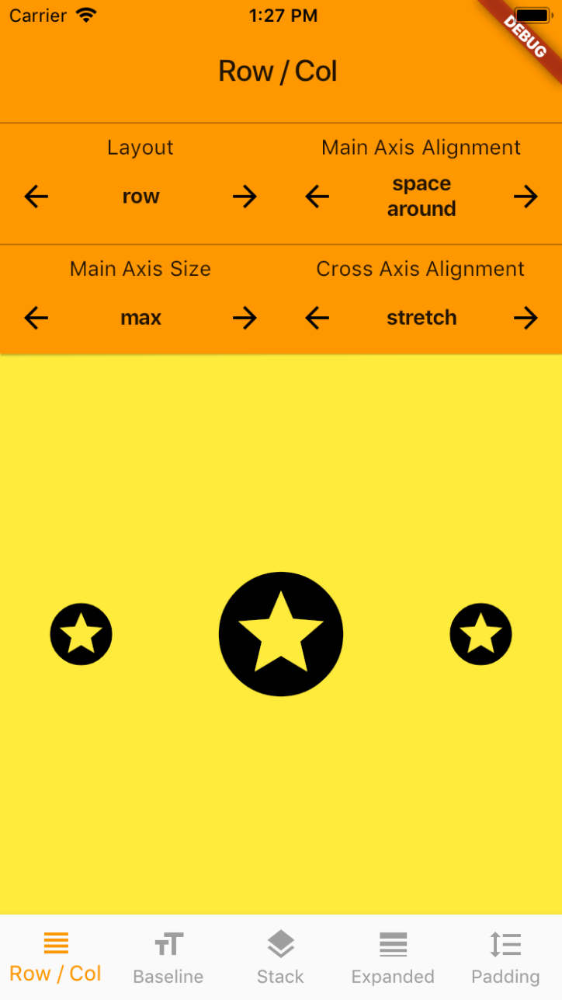
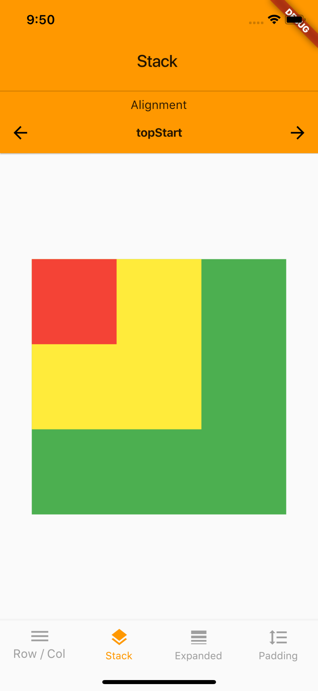
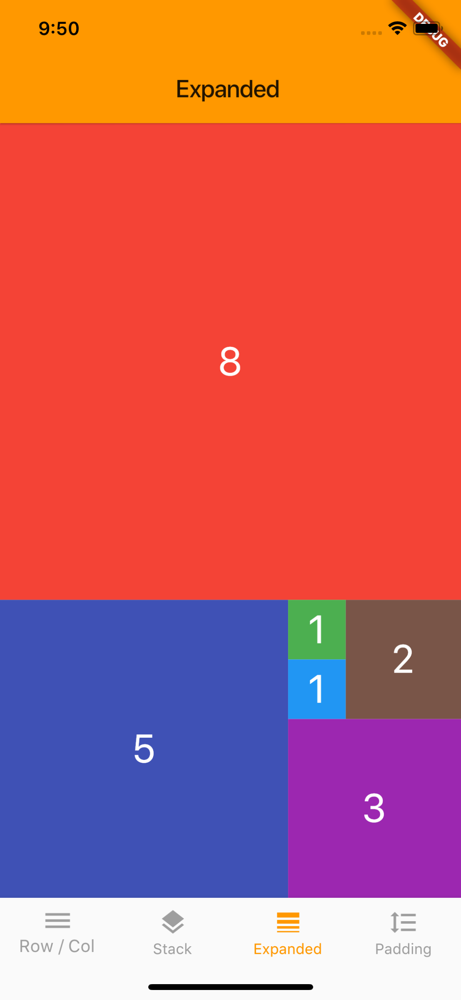
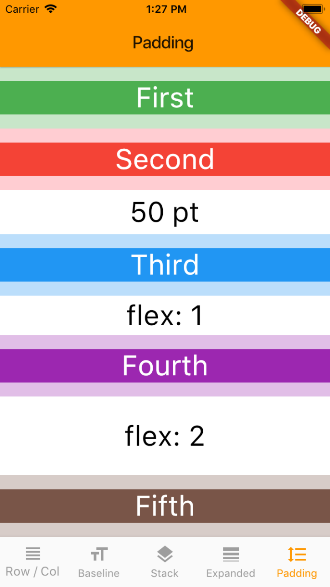

# Flutter Layout: The Definitive Guide

### Keep all your favourite Flutter layouts in your pocket. 😉

This is an interactive demo app showing how to use the most common layout objects in Flutter.

You can run this project on your simulator or device. 

Oh, and the demo app itself is built with - guess what - a combination of Flutter layouts.

# Table of Contents

- [Row / Column](#rowColumn)
- [Stack](#stack)
- [Expanded](#expanded)
- [Padding](#padding)

## Row / Column

- [Row](https://docs.flutter.io/flutter/widgets/Row-class.html)
- [Column](https://docs.flutter.io/flutter/widgets/Column-class.html)
- [MainAxisAlignment](https://docs.flutter.io/flutter/rendering/MainAxisAlignment-class.html)
- [MainAxisSize](https://docs.flutter.io/flutter/rendering/MainAxisSize-class.html)
- [CrossAxisAlignment](https://docs.flutter.io/flutter/rendering/CrossAxisAlignment-class.html)

## Stack

- [Stack](https://docs.flutter.io/flutter/widgets/Stack-class.html)
- [AlignmentDirectional](https://docs.flutter.io/flutter/painting/AlignmentDirectional-class.html)

## Expanded

Tags: Fibonacci, Golden Ratio. 

- [Expanded](https://docs.flutter.io/flutter/widgets/Expanded-class.html)

## Padding

- [Expanded](https://docs.flutter.io/flutter/widgets/Expanded-class.html)
- [SizedBox](https://docs.flutter.io/flutter/widgets/SizedBox-class.html)

### [License: MIT](LICENSE.md)

