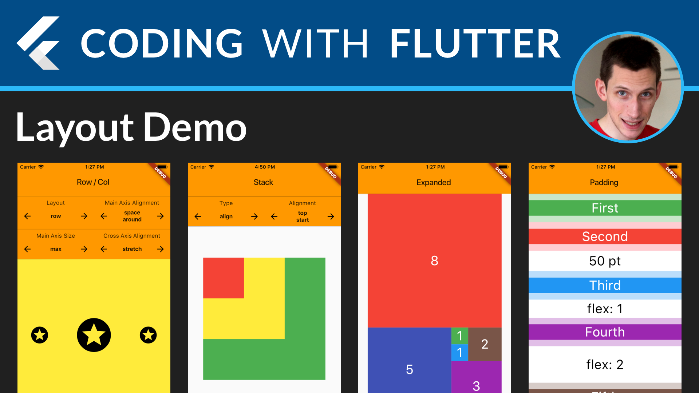
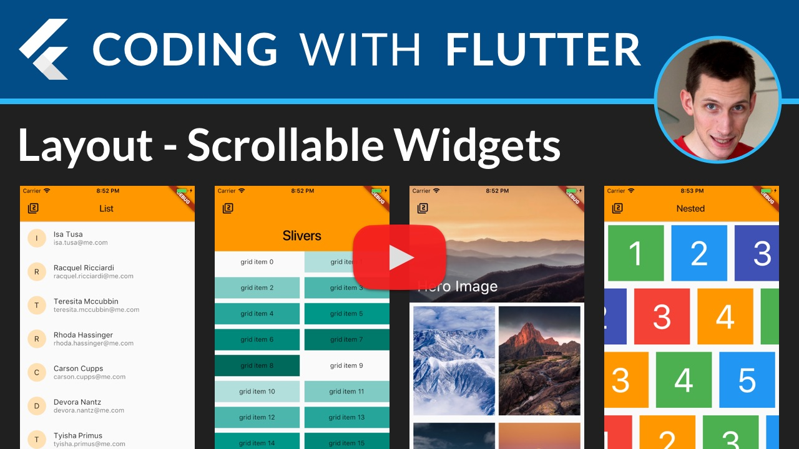

## Super Useful Flutter Layouts - Right in Your Pocket. 😉

YouTube video walkthroughs with explanations here: 

This app shows you how to use the most common layouts in Flutter.

You can run this project on your simulator or device.

Oh, and the app itself is built with - guess what - a combination of Flutter layouts. So Meta! 😎

### For more articles and video tutorials, check out [Coding With Flutter](https://codingwithflutter.com/).

# Table of Contents

- [Row / Column](#row--column)
- [Baseline](#baseline)
- [Stack](#stack)
- [Expanded](#expanded)
- [Padding](#padding)
- [PageView](#pageview)
- [ListView](#listview)
- [Slivers](#slivers)
- [Hero Image](#hero-image)
- [Nested Lists](#nested-lists)

## Row / Column

- [Row](https://docs.flutter.io/flutter/widgets/Row-class.html)
- [Column](https://docs.flutter.io/flutter/widgets/Column-class.html)
- [MainAxisAlignment](https://docs.flutter.io/flutter/rendering/MainAxisAlignment-class.html)
- [MainAxisSize](https://docs.flutter.io/flutter/rendering/MainAxisSize-class.html)
- [CrossAxisAlignment](https://docs.flutter.io/flutter/rendering/CrossAxisAlignment-class.html)

## Baseline

- [Baseline](https://docs.flutter.io/flutter/widgets/Baseline-class.html)
- [CrossAxisAlignment](https://docs.flutter.io/flutter/rendering/CrossAxisAlignment-class.html)

## Stack

- [Stack](https://docs.flutter.io/flutter/widgets/Stack-class.html)
- [AlignmentDirectional](https://docs.flutter.io/flutter/painting/AlignmentDirectional-class.html)
- [Positioned](https://docs.flutter.io/flutter/widgets/Positioned-class.html)

## Expanded

Wikipedia: [Golden Spiral](https://en.wikipedia.org/wiki/Golden_spiral) (also: Fibonacci, Golden Ratio). 

- [Expanded](https://docs.flutter.io/flutter/widgets/Expanded-class.html)
- [LayoutBuilder](https://docs.flutter.io/flutter/widgets/LayoutBuilder-class.html)

## Padding

- [Expanded](https://docs.flutter.io/flutter/widgets/Expanded-class.html)
- [SizedBox](https://docs.flutter.io/flutter/widgets/SizedBox-class.html)

## PageView

- [PageView](https://docs.flutter.io/flutter/widgets/PageView-class.html)

## ListView

- [ListView](https://docs.flutter.io/flutter/widgets/ListView-class.html)
- [ListTile](https://docs.flutter.io/flutter/material/ListTile-class.html)

## Slivers

- [CustomScrollView](https://docs.flutter.io/flutter/widgets/CustomScrollView-class.html)
- [SliverAppBar](https://docs.flutter.io/flutter/material/SliverAppBar-class.html)
- [SliverGrid](https://docs.flutter.io/flutter/widgets/SliverGrid-class.html)
- [SliverFixedExtentList](https://docs.flutter.io/flutter/widgets/SliverFixedExtentList-class.html)

## Hero Image

- [Stack](https://docs.flutter.io/flutter/widgets/Stack-class.html)
- [Positioned](https://docs.flutter.io/flutter/widgets/Positioned-class.html)
- [SafeArea](https://docs.flutter.io/flutter/widgets/SafeArea-class.html)
- [SliverPersistentHeader](https://docs.flutter.io/flutter/widgets/SliverPersistentHeader-class.html)
- [SliverGrid](https://docs.flutter.io/flutter/widgets/SliverGrid-class.html)

## Nested Lists

- [ListView](https://docs.flutter.io/flutter/widgets/ListView-class.html)

### For more articles and video tutorials, check out [Coding With Flutter](https://codingwithflutter.com/).

### [License: MIT](LICENSE.md)

### Attribution

Youtube Play Icon by [Youtube Clipart](http://clipartmag.com/youtube-clipart).

